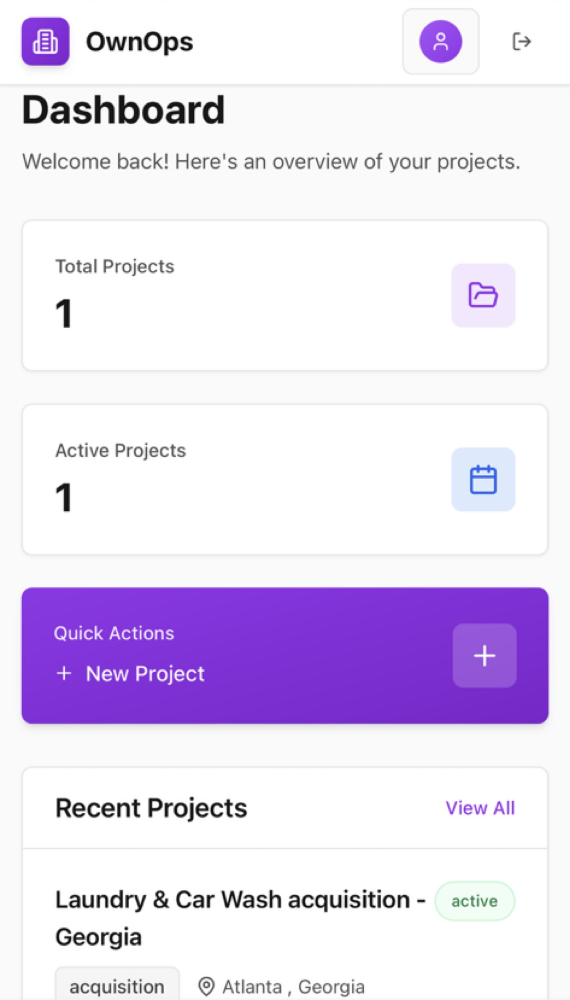
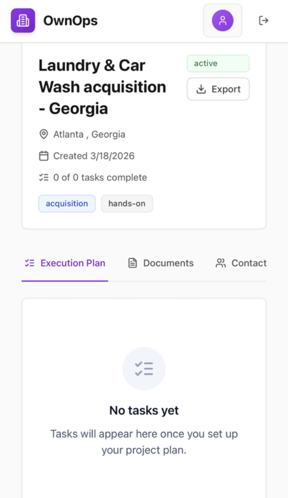
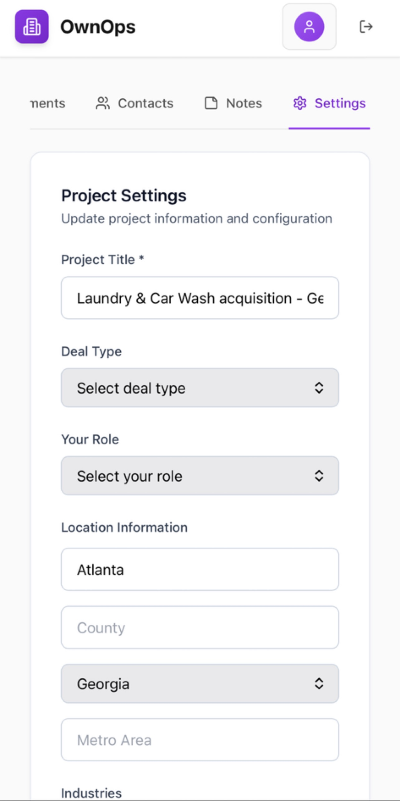

# 🏗️ OwnOps – Operations Management System

"Streamline operations. Track workflows. Scale real-world businesses."

---

## 📌 Overview

OwnOps is a system designed to manage logistics, acquisitions, and service operations in one place.

It helps operators:

- Track deals and opportunities
- Manage workflows and task pipelines
- Organize business operations across multiple ventures

---

## 🎯 Why I Built It

Managing multiple business operations (logistics, deliveries, acquisitions) often leads to:

- Scattered information
- Missed opportunities
- Poor workflow visibility

OwnOps was built to centralize operations into a single structured system, improving clarity, execution, and scalability.

---

## 🚀 Features

- 📊 Opportunity & deal tracking
- 🧩 Workflow and task management
- 📍 Logistics coordination support
- 🗂️ Centralized operations dashboard
- ⚙️ Scalable system design for multiple business types

---

## 🧠 Key Concept

OwnOps is designed around operational clarity:

- Every opportunity becomes a trackable workflow
- Every workflow becomes measurable progress
- Every system supports scaling without chaos

---

## 📸 App Preview

### 📊 Operations Dashboard

### 🧩 Workflow Management

### 📍 Opportunity Tracking

---

## 🧰 Tech Stack

- React Native (Expo)
- TypeScript
- Supabase (database + backend)
- Node.js (API logic)

---

## 📈 What I Learned

- Designing systems for real-world operations
- Structuring scalable workflows
- Building tools for execution, not just tracking
- Thinking in systems instead of isolated features

---

## 🔄 Status

In active development — expanding workflow automation, filtering, and real-time tracking features.

---

## 👤 Author

Babatunde Jegede
